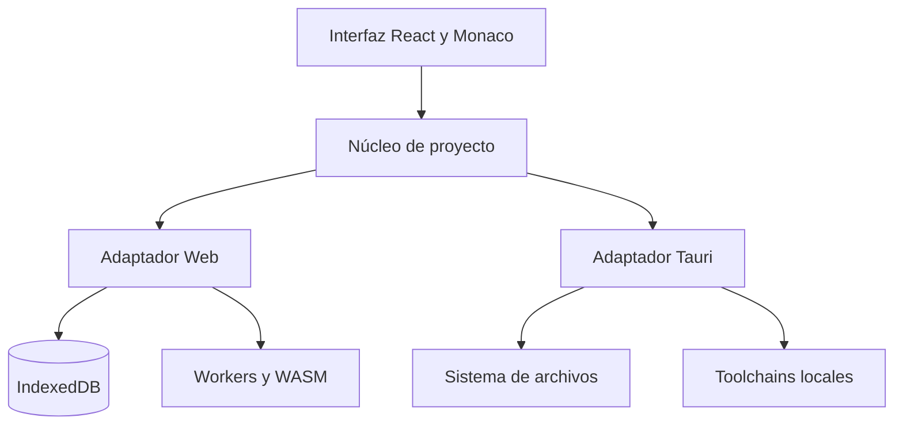

# Arquitectura de IDE

## Objetivo

IDE comparte una sola experiencia de producto entre dos entornos con capacidades diferentes:

- la aplicación web es una SPA estática, privada y ejecutable desde GitHub Pages;
- la aplicación Desktop envuelve esa SPA con Tauri y añade acceso controlado al sistema operativo.

La capa de interfaz nunca presupone que dispone de Node, Java o un compilador. Cada función consulta primero el registro de runtimes y comunica claramente su disponibilidad.

## Capas

### Interfaz

`src/components` implementa el shell, los editores divididos, los paneles, ventanas internas, menús y asistentes. Las acciones de producto no viven dentro de los componentes: se concentran en `src/services`.

### Estado y proyectos

`src/store/ideStore.ts` usa Zustand y persiste una representación serializable en IndexedDB. Un proyecto contiene archivos de texto planos con rutas relativas. El árbol visible es una proyección de esas rutas y no duplica datos.

Las ventanas secundarias reciben el mismo origen, leen el estado persistido y sincronizan cambios mediante `BroadcastChannel`. En Tauri, cada editor desacoplado es un WebView nativo independiente.

### Diagnóstico

`diagnostics.worker.ts` ejecuta `diagnosticsEngine.ts` fuera del hilo de la interfaz. Analiza delimitadores, cadenas, sangría, declaraciones sin uso, asignaciones sin declarar, importaciones relativas y algunas incompatibilidades básicas. Monaco conserva además sus diagnósticos de JavaScript y TypeScript.

### Ejecución web

- HTML/CSS/JavaScript: `iframe` con sandbox y puente de consola.
- JavaScript: Worker efímero con límite de ocho segundos.
- TypeScript: SWC WebAssembly cargado solo al ejecutar.
- Python: Pyodide 314 en Worker, descargado desde su CDN oficial solo al primer uso.

No se simulan compilaciones. Un lenguaje sin runtime web presenta la razón y dirige a Desktop.

### Ejecución Desktop

`src-tauri/src/lib.rs` expone órdenes pequeñas y tipadas. Las rutas se validan antes de escribir, se ignoran árboles generados al explorar y ningún código se pasa a una shell. Los procesos admitidos se seleccionan mediante una tabla cerrada y se detienen a los treinta segundos.

Pipelines iniciales: Node/TypeScript, CPython, JDK/Maven, GCC/G++, .NET, Rust/Cargo, Kotlin/JVM, PHP, Go y Ruby.

## Seguridad

- CSP de Tauri se mantiene abierta en esta primera fase porque Pyodide y las vistas de usuario necesitan recursos dinámicos. Antes de una versión estable se dividirán el origen de la aplicación y el de la vista previa para aplicar políticas distintas.
- El `iframe` de vista no recibe `allow-same-origin`.
- Los binarios no incluyen compiladores de terceros; detectan los instalados por el usuario.
- La ejecución nativa usa `Command` con argumentos separados, nunca concatenación de shell.
- No hay telemetría, cuentas ni servicios de guardado remoto.

## Límites deliberados de la primera edición

- Un servidor de desarrollo que permanece vivo se detiene tras treinta segundos. El siguiente módulo será un gestor de procesos persistentes con parada explícita y streaming de salida.
- El análisis semántico profundo de Java, C#, C/C++ y Rust requiere integrar sus servidores de lenguaje en Desktop.
- El Git visual muestra el estado del documento; operaciones Git nativas se incorporarán en un módulo aislado.
